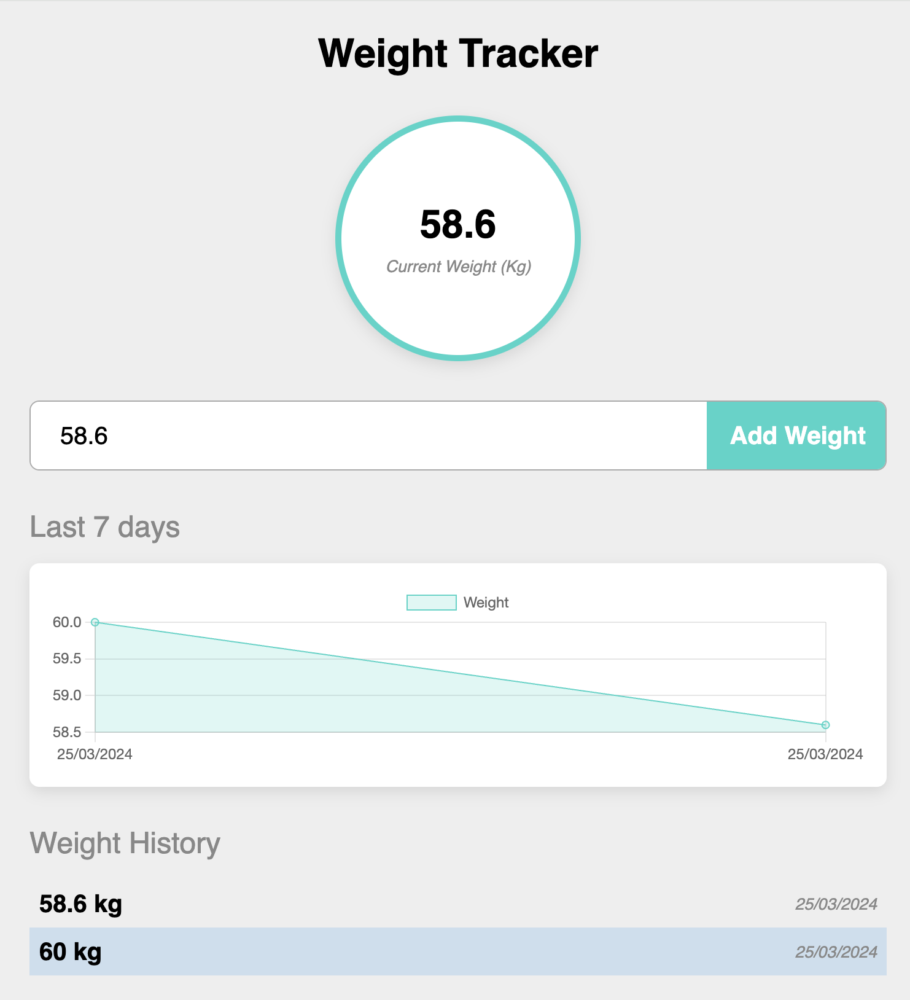

# Weight Tracker - Track Your Progress, Transform Your Life!

Introducing a weight tracker utilizing Vue JS and the composition API. Leveraging Vue's watch, nextTick, ref, shallowRef, computed, and Chart JS to create a visual tracker!

## Features

- Track weight changes over time.
- Visual representation using Chart JS.
- Utilizes Vue's composition API for state management.

 

## Project Setup

To set up the project locally, follow these steps:

- Clone the repository: https://github.com/bahumuhawa/WeightTracker.git
- Navigate to the project directory: `cd project-directory`
- Install dependencies: `npm install`
- Start the development server: `npm run dev`

## Vue 3 + Vite

This template should help get you started developing with Vue 3 in Vite. The template uses Vue 3 `<script setup>` SFCs. Check out the [script setup docs](https://v3.vuejs.org/api/sfc-script-setup.html#sfc-script-setup) to learn more.

## Recommended IDE Setup

- [VS Code](https://code.visualstudio.com/) + [Vue - Official](https://marketplace.visualstudio.com/items?itemName=Vue.volar) (previously Volar) and disable Vetur
